## 项目介绍

```Lemon-cloud``` 是一款微服务商城系统，采用了最新版本的 **Spring Cloud** +**Spring Cloud Alibaba** +**Mybatis-Plus** +**Redis** 等核心技术，同时提供了基于Vue的管理后台。```Lemon-cloud``` 在电商业务的基础上集成了注册中心、配置中心、授权认证、微服务网关等系统功能，采用稳定框架开发，减少依赖，具备出色的运行效率，扩展性、稳定性高，后面有时间我将持续收集大家反馈不断更新迭代。


## 目录结构说明
```

Lemon-cloud
├─lemon-common  --基础工具类
├─lemon-gateway  --网关微服务
├─lemon-web-UI  --web前端模块
├─lemon-wx-mall  --微信小程序前端模块
├─lemon-oauth
│  ├─lemon-service-oauth  --权限认证微服务
│  └─lemon-service-oauth-api  --权限认证实体模块
├─lemon-service
│  ├─lemon-service-coupon  --优惠券微服务
│  ├─lemon-service-file  --文件微服务
│  ├─lemon-service-goods  --商品微服务
│  ├─lemon-service-order  --订单微服务
│  └─lemon-service-pay  --支付微服务
└─lemon-service-api
  ├─lemon-service-coupon-api  -- 优惠券实体模块
  ├─lemon-service-file-api  -- 文件实体模块
  ├─lemon-service-goods-api  -- 商品实体模块
  ├─lemon-service-order-api  -- 订单实体模块
  └─lemon-service-pay-api  -- 支付实体模块

```


## 架构设计
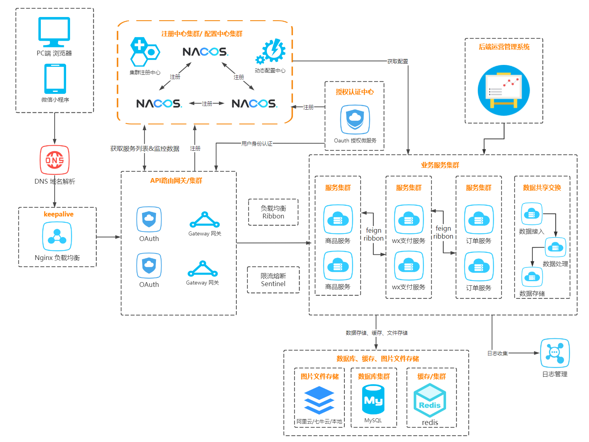


## 开发环境
工具|版本号
---|:--
JDK|1.8
MySql|5.7
Redis|5.0
Nginx|1.21.6
Elasticsearch|7.4.2
Spring Boot| 2.6.3
Spring Cloud|2021.0.1
Spring Cloud Alibaba|2021.0.1.0


##  功能概要
### 1.小程序端
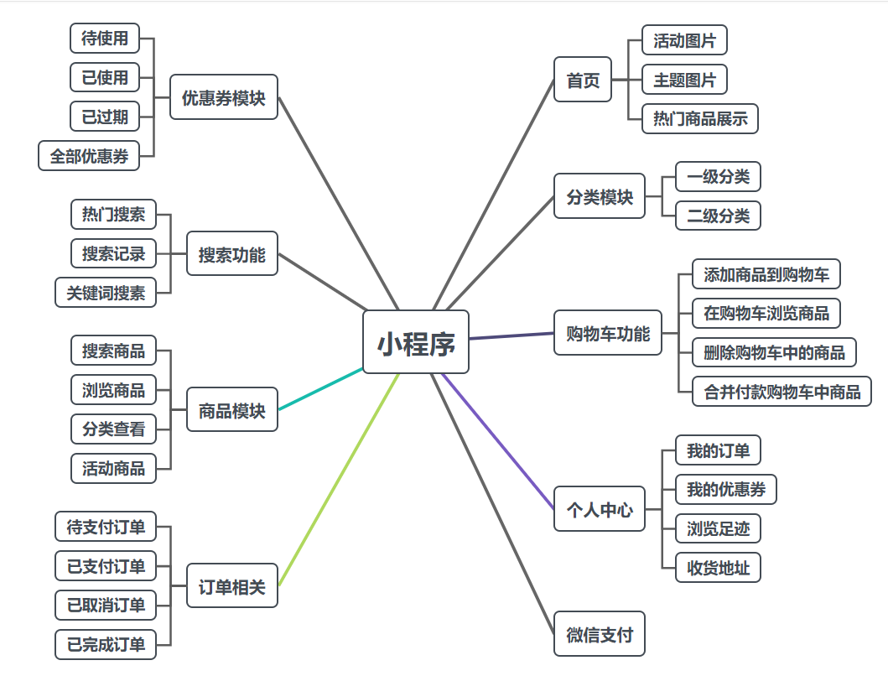
### 2.PC后台管理端
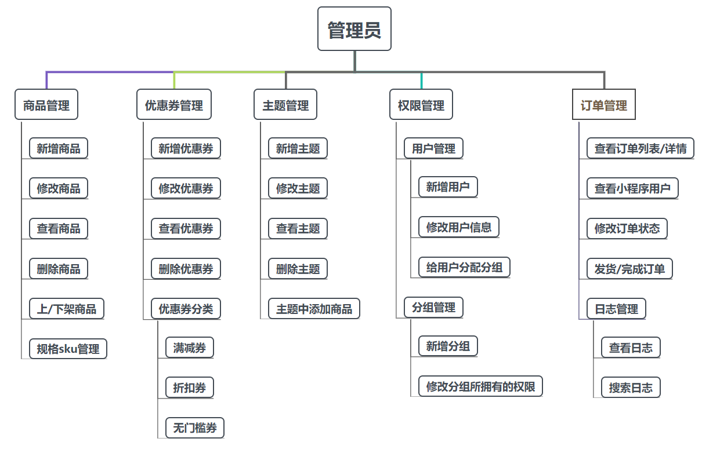


## 演示地址

PC管理端：http://cms.shaogezhu.com/
小程序端：暂未开放，可以参考下面运行效果图


## 部署启动

### 步骤：
1. 修改每个服务的MYSQL数据库地址
2. 修改每个服务的Nacos、Redis等的地址
3. 在oauth服务配置文件中，配置小程序的appid和密钥
4. 都配置完成之后，需要先启动oauth（权限认证服务）
5. oauth服务启动成功后，其它的服务可以任意顺序启动


### 运行效果展示

#### 1.小程序端截图

##### 1）首页
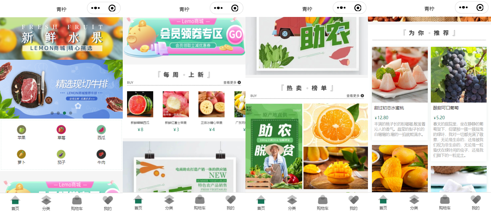
##### 2）分类/搜索
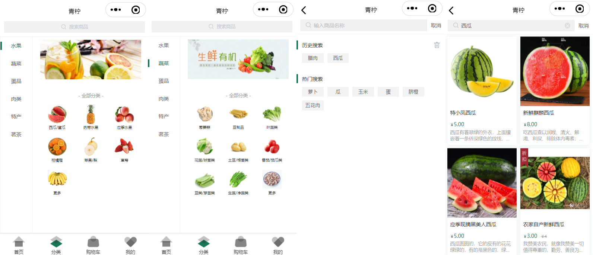
##### 3）购物车
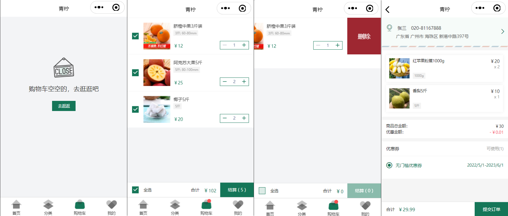
##### 4）个人中心
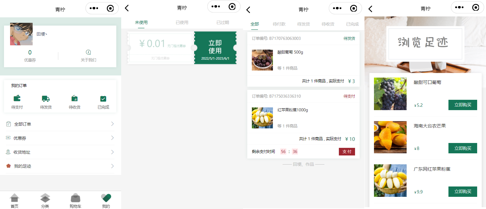
##### 5）商品详情
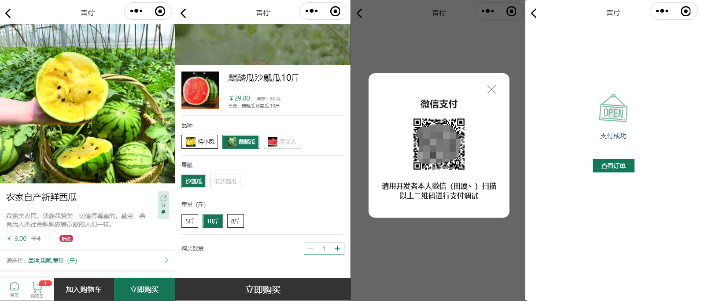


#### 2.PC管理端截图

##### 1)操作日志
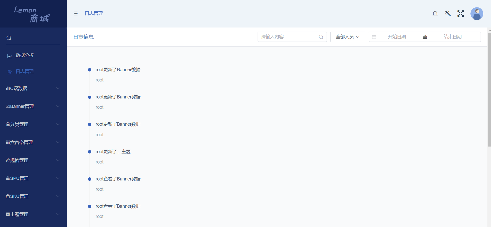

##### 2）商品管理
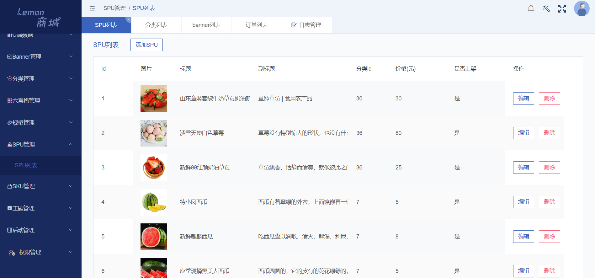

##### 3）分类管理
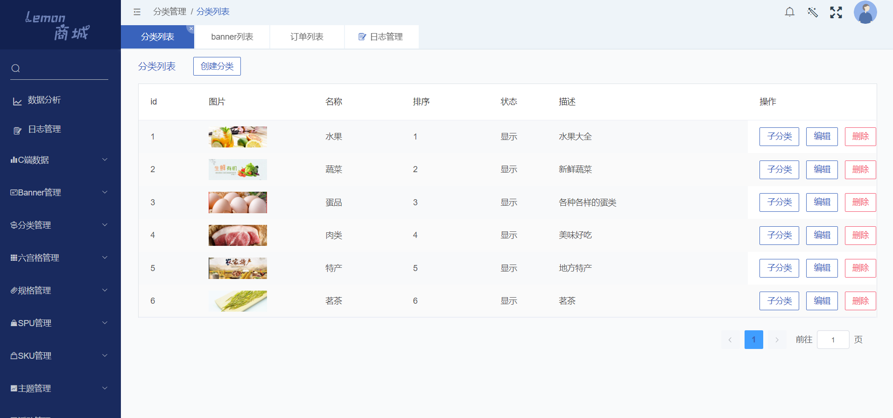

##### 4）动态权限管理
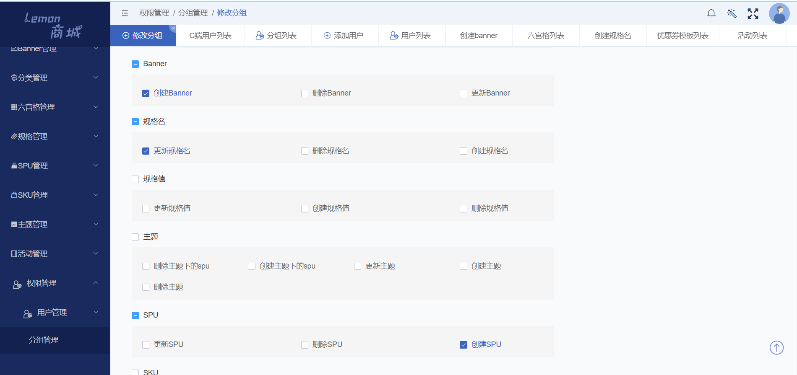


## 特别鸣谢

感谢[林间有风](https://gitee.com/talelin)团队👨‍👩‍👦‍👦，小程序端基于[lin-ui](https://gitee.com/talelin/lin-ui)，Web后台管理端基于[lin-cms-vue](https://gitee.com/talelin/lin-cms-vue) 进行快速二次开发🚀🚀🚀。

 

💝 **如果觉得这个项目对你有帮助，可点击右上角Watch、Star项目，获取项目第一时间更新，欢迎提交Issues和PR项目。如有其它需求请联系作者QQ：1090404459！** 
